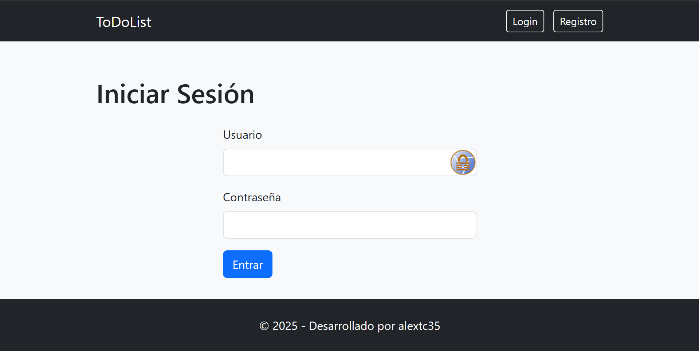
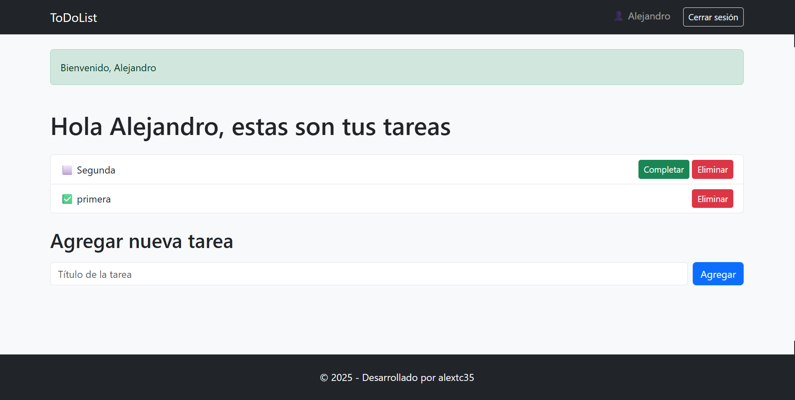

# 📝 ToDo-List App

[](#)
[](LICENSE)
[](#)

**ToDo-List App** es una aplicación web desarrollada en **Node.js + Express + MongoDB** que permite a usuarios registrados gestionar sus tareas personales: añadir, completar y eliminar tareas.

## 🚀 Características

✅ Registro y autenticación de usuarios con sesiones  
✅ CRUD de tareas (crear, listar, marcar como completadas, eliminar)  
✅ Cada usuario ve solo sus propias tareas  
✅ Middleware de autenticación para proteger rutas  
✅ Diseño profesional con Bootstrap 5  
✅ Flash messages para notificaciones amigables  
✅ Layout global con Express EJS Layouts  
✅ Preparada para despliegue

---

## 🖥️ **Tecnologías utilizadas**

- **Node.js** + **Express**
- **MongoDB** + **Mongoose**
- **EJS** como motor de plantillas
- **express-session** para gestión de sesiones
- **bcryptjs** para cifrado de contraseñas
- **connect-flash** para mensajes flash
- **Bootstrap 5** para diseño
- **express-ejs-layouts** para layouts globales
- **dotenv** para configuración por entorno

---

## 📂 **Estructura de carpetas**

```
ToDo-List/
├── src/
│ ├── controllers/
│ ├── models/
│ ├── routes/
│ ├── middlewares/
│ └── views/
├── .env
├── app.js
├── package.json
└── README.md
```

## ⚙️ **Instalación y uso**

1️⃣ Clona el repositorio:

```bash
git clone https://github.com/tu-usuario/todolist-app.git
cd todolist-app
```

2️⃣ Instala las dependencias:

```bash
npm install
```

3️⃣ Crea un archivo .env en la raíz con tu configuración:

```bash
MONGO_URI=mongodb://localhost:27017/todolist_db
SECRET_KEY=tu_clave_secreta
PORT=3000
```

4️⃣ Inicia el servidor:

```bash
npm start
```

✅ Luego accede en tu navegador a:
http://localhost:3000/auth/login

## 📝 Comandos útiles

* `npm start` → inicia la aplicación
* `npm run dev` (si añades nodemon) → inicia en modo desarrollo

## 🛡️ **Rutas principales**

| Método | Ruta               | Descripción                        |
|--------|-------------------|-----------------------------------|
| GET    | /auth/login       | Mostrar formulario de login        |
| POST   | /auth/login       | Procesar login                     |
| GET    | /auth/register    | Mostrar formulario de registro     |
| POST   | /auth/register    | Procesar registro                  |
| GET    | /auth/logout      | Cerrar sesión                      |
| GET    | /tasks            | Listar tareas del usuario logueado |
| POST   | /tasks/add        | Añadir nueva tarea                 |
| POST   | /tasks/delete/:id | Eliminar tarea                     |
| POST   | /tasks/complete/:id | Marcar tarea completada          |

---

## 💡 **Posibles mejoras futuras**

✨ Confirmación de contraseña en registro  
✨ Edición de tareas  
✨ Filtros por tareas completadas/pendientes  
✨ Roles de usuario (admin / user)  
✨ Deploy en Render / Railway / Heroku  
✨ API REST para integración externa

---

## 📄 **Licencia**

Este proyecto está bajo la licencia MIT.  
© 2025 - Desarrollado por **alextc35**

---

## 🎉 **Capturas de pantalla**



